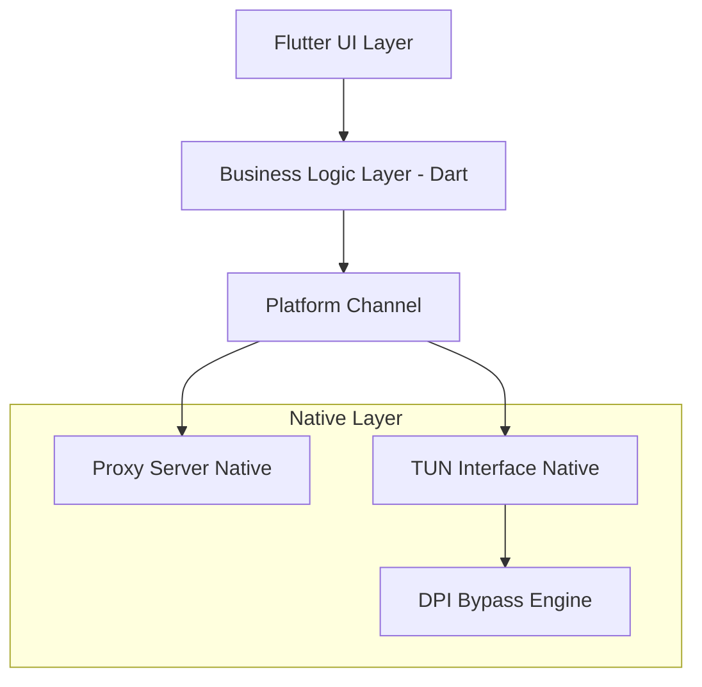
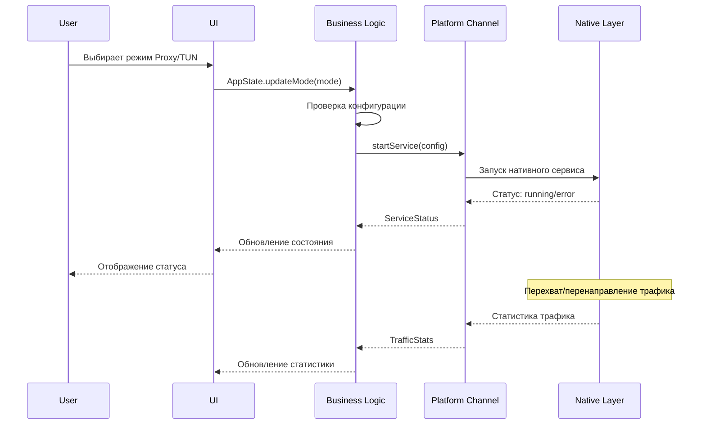
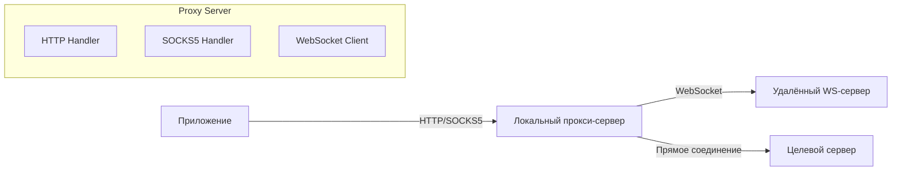
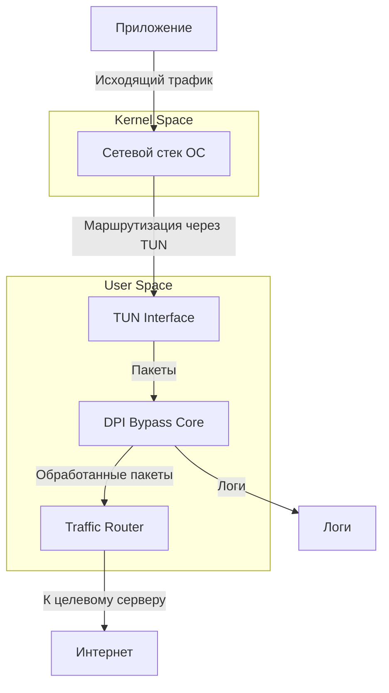
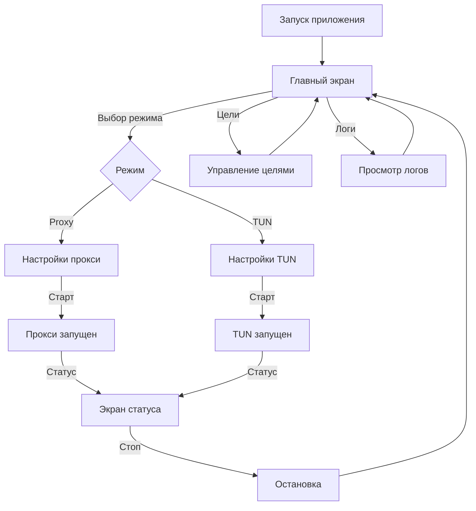

# Архитектура приложения ShadowGate

## 1. Обзор

**ShadowGate** — Flutter-приложение для обхода блокировок, работающее в двух режимах:
- **Прокси-режим** — локальный SOCKS5/HTTP прокси-сервер с возможностью WebSocket upstream
- **TUN-режим** — виртуальный сетевой интерфейс с полным DPI-обходом (фрагментация TCP, изменение TTL, подмена Host)

**Целевые платформы:** Windows, Android, macOS, iOS

---

## 2. Архитектура приложения



### 2.1. Структура директорий

```
lib/
├── main.dart                          # Точка входа
├── app.dart                           # MaterialApp, routing
├── core/
│   ├── constants.dart                 # Константы, типы целей
│   ├── types.dart                     # Перечисления: AppMode, ProxyType, TargetService
│   └── platform_utils.dart            # Определение платформы
├── models/
│   ├── proxy_config.dart              # Конфигурация прокси
│   ├── tun_config.dart                # Конфигурация TUN
│   ├── target_config.dart             # Конфигурация целевого сервиса
│   └── app_state.dart                 # Состояние приложения
├── services/
│   ├── proxy_service.dart             # Управление прокси-сервером
│   ├── tun_service.dart               # Управление TUN-интерфейсом
│   ├── dpi_bypass_service.dart        # Логика DPI-обхода
│   ├── target_manager.dart            # Управление списком целей
│   └── platform_channel_service.dart  # Абстракция над PlatformChannel
├── ui/
│   ├── screens/
│   │   ├── home_screen.dart           # Главный экран с выбором режима
│   │   ├── proxy_config_screen.dart   # Настройки прокси
│   │   ├── tun_config_screen.dart     # Настройки TUN
│   │   └── targets_screen.dart        # Управление целями
│   ├── widgets/
│   │   ├── mode_selector.dart         # Переключатель режимов
│   │   ├── connection_status.dart     # Статус подключения
│   │   ├── target_list.dart           # Список целей
│   │   └── log_viewer.dart            # Просмотр логов
│   └── theme/
│       └── app_theme.dart             # Тема приложения
├── providers/
│   ├── app_state_provider.dart        # State management
│   └── log_provider.dart              # Логирование
└── utils/
    ├── logger.dart                    # Утилита логирования
    └── validators.dart                # Валидация ввода
```

---

## 3. Компоненты и их взаимодействие

### 3.1. Поток данных



### 3.2. Прокси-режим



**Компоненты прокси-сервера:**
- **HTTP Handler** — обрабатывает HTTP CONNECT и прямые HTTP-запросы
- **SOCKS5 Handler** — реализует протокол SOCKS5 (RFC 1928)
- **WebSocket Client** — перенаправляет трафик через WebSocket (опционально)
- **DNS Resolver** — резолвинг через DoH/DoT для обхода блокировок DNS

### 3.3. TUN-режим



**Методы DPI-обхода:**
1. **Фрагментация TCP** — разбиение TCP-пакетов на мелкие фрагменты (MSS clamping)
2. **Изменение TTL** — установка TTL=1 для первого пакета handshake
3. **Подмена Host** — маскировка Host header под легитимный трафик
4. **Перепаковка пакетов** — изменение порядка TCP-сегментов
5. **HTTPS-обфускация** — добавление случайных данных в TLS ClientHello

---

## 4. Зависимости (pubspec.yaml)

```yaml
dependencies:
  flutter:
    sdk: flutter
  provider: ^6.1.2           # State management
  shared_preferences: ^2.3.3  # Хранение настроек
  network_info_plus: ^6.0.0   # Информация о сети
  dns_client: ^0.4.0          # DNS-резолвинг
  
dev_dependencies:
  flutter_test:
    sdk: flutter
  flutter_lints: ^6.0.0
```

**Платформенные интеграции (через platform channels):**

| Платформа | Прокси-режим | TUN-режим |
|-----------|-------------|-----------|
| **Windows** | Dart `HttpServer` + dart:io | WinDivert (C++ FFI) |
| **Android** | Dart `HttpServer` + dart:io | VpnService (Kotlin) |
| **macOS** | Dart `HttpServer` + dart:io | utun (Swift) |
| **iOS** | Dart `HttpServer` + dart:io | NEPacketTunnelProvider (Swift) |

---

## 5. Управление целями

```dart
enum TargetService {
  telegram,
  discord,
  youtube,
  custom,
}

class TargetConfig {
  final String name;
  final List<String> domains;       // example.com
  final List<String> ipRanges;      // 149.154.160.0/20
  final List<int> ports;            // 443, 80
  final bool enabled;
  final DpiMethod dpiMethod;        // fragmentation, ttl, host_spoof
}
```

**Предустановленные цели:**

| Сервис | Домены | IP-диапазоны | Порты |
|--------|--------|-------------|-------|
| Telegram | api.telegram.org, t.me, telegram.org | 149.154.160.0/20, 91.108.56.0/22 | 443, 80 |
| Discord | discord.com, discord.gg, discordapp.net | 162.159.128.0/17 | 443 |
| YouTube | youtube.com, googlevideo.com, ytimg.com | 142.250.0.0/15, 172.217.0.0/16 | 443 |

---

## 6. UI/UX Flow



**Главный экран содержит:**
- Переключатель режимов (Proxy / TUN) — крупные карточки
- Кнопка "Старт/Стоп"
- Статус подключения (зелёный/красный индикатор)
- Краткая статистика (трафик, скорость)
- Bottom navigation: Главная / Цели / Логи / Настройки

---

## 7. Этапы реализации

### Этап 1: Базовая структура проекта и зависимости
- Настройка pubspec.yaml с зависимостями
- Создание структуры директорий
- Базовая тема и routing

### Этап 2: UI — главный экран с выбором режима
- Главный экран с переключателем Proxy/TUN
- Экран настроек прокси (порт, тип, WS-сервер)
- Экран настроек TUN (методы DPI, интерфейс)
- Экран управления целями
- Экран логов

### Этап 3: Прокси-режим (SOCKS5 + HTTP)
- Реализация HTTP прокси-сервера на Dart
- Реализация SOCKS5 прокси-сервера на Dart
- WebSocket клиент для upstream
- DNS-резолвинг через DoH

### Этап 4: TUN-режим с DPI-обходом
- **Windows**: C++ FFI с WinDivert
- **Android**: Kotlin VpnService
- **macOS/iOS**: Swift NEPacketTunnelProvider
- Реализация методов DPI-обхода:
  - Фрагментация TCP
  - Изменение TTL
  - Подмена Host header
  - Перепаковка пакетов

### Этап 5: Управление целями
- Предустановленные цели (Telegram, Discord, YouTube)
- Добавление кастомных целей
- Включение/отключение целей
- Выбор метода DPI для каждой цели

### Этап 6: Интеграция с платформенными API
- Platform channels для каждого режима
- Обработка разрешений (VPN на Android, админ на Windows)
- Обработка ошибок и восстановление

### Этап 7: Тестирование и отладка
- Unit-тесты для бизнес-логики
- Интеграционные тесты для UI
- Тестирование на реальных устройствах

---

## 8. Технические решения

### 8.1. State Management
Используем **Provider** — достаточно для данного приложения, не добавляет лишней сложности.

### 8.2. Платформенные каналы
Используем **Pigeon** для типобезопасных platform channels, что упрощает поддержку и уменьшает количество ошибок.

### 8.3. Логирование
Собственная система логирования с уровнями (DEBUG, INFO, WARN, ERROR) и возможностью просмотра в приложении.

### 8.4. Безопасность
- Хранение конфигураций в SharedPreferences (без чувствительных данных)
- Возможность установки пароля на прокси
- Проверка целостности конфигурации

---

## 9. Риски и ограничения

| Риск | Вероятность | Влияние | Митигация |
|------|------------|---------|-----------|
| Сложность TUN на iOS/macOS | Высокая | Среднее | Использовать NetworkExtension |
| WinDivert требует админ-прав | Высокая | Низкое | Документировать требование |
| Разные версии Android VPN API | Средняя | Среднее | Тестировать на нескольких версиях |
| Производительность Dart-прокси | Низкая | Среднее | Вынести в нативный код при необходимости |